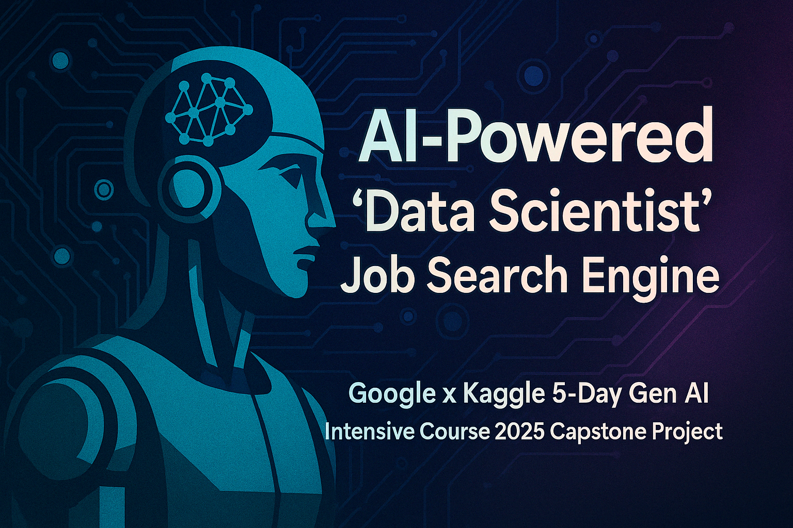

  

# 📦 AI-Powered Data Scientist Job Search Engine

Capstone Project for the Google x Kaggle 5-Day GenAI Intensive Course 2025

---

## 👥 Author

Sam Hossain

---

## 🎯 Overview

This project is an AI-powered job search engine designed to intelligently match data science job listings to a candidate profile using GenAI techniques. It was inspired by a personal challenge I faced while approaching graduation from my Master of Management Analytics program at Queen’s University.

---

## 🔗 Live Notebook

Check it out on Kaggle:
https://www.kaggle.com/code/hossainsam/data-scientist-job-search-engine

---

## 🧠 Key Features

✅ Scrapes real-time Data Scientist job listings from LinkedIn guest views
✅ Embeds job descriptions using Google Gemini (text-embedding-004)
✅ Stores and semantically matches listings with ChromaDB
✅ Generates concise, JSON-based match explanations using Gemini
✅ Prioritizes results by location and recency
✅ Outputs a professional dark-mode HTML dashboard with clickable job links

---

## 🧩 Technologies Used

- Google Gemini (Generative AI)
- ChromaDB (Vector Store)
- BeautifulSoup + Requests (Web Scraping)
- Pandas (Data processing)
- HTML export for dashboard display

---

## 🧪 GenAI Capabilities Demonstrated

- Prompt Engineering & Structured Output
- Embeddings & Semantic Search
- Reasoning and explanation generation (JSON mode)
- Production-minded MLOps workflow structure

---

## 📅 Course Learnings Mapped

| Day   | Learning                   | Application                          |
| ----- | -------------------------- | ------------------------------------ |
| Day 1 | Prompt Engineering         | Structured match reasoning           |
| Day 2 | Embeddings & Vector Stores | Matching profile ↔ job               |
| Day 3 | Agents & Modularity        | Pipeline structure                   |
| Day 4 | Domain-Specific LLMs       | Tailoring to data science job search |
| Day 5 | MLOps                      | System workflow, reusable outputs    |

---

## 📈 Results

- Personalized recommendations for top 10 jobs
- Clickable links, posting dates, and match reasoning
- Built for high-frequency daily use
- Ready to scale with Gemini’s paid API

